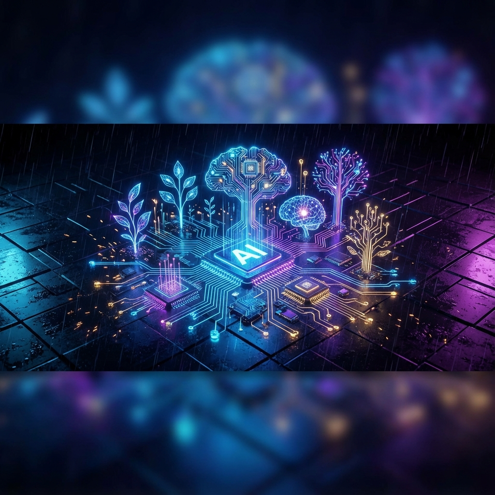

  

   
  <h1>🚀 Architecting the Future of Tech in Nepal</h1>
  <h3>Backend Developer • AI Enthusiast • 2025 ICT Award Rising Star Finalist</h3>
   

---

### ⚡ The Mission

I'm **Anil Magar**, a builder at heart. I don't just write code; I engineer solutions that solve real problems. Currently, I'm bridging the gap between **traditional agriculture and modern AI** with *Agro Connect*, while pushing the boundaries of what's possible in the **MERN stack** and **Django**.

When I'm not deploying containers or training models, I'm probably clutching a round in **Valorant** or analyzing the soundstage of a new track. 🎧

---

<table border="0" width="100%">
  <tr>
    <td width="60%" valign="top">
      <h3>🏆 The Highlight Reel</h3>
       
      <b>� Top 14 Finalist - ICT Award 2025 (Rising Star)</b> 
      Recognized for innovation and impact in the tech sector.
        
      <b>🌾 Agro Connect</b> 
      <i>Founder & Lead Developer</i> 
      A revolutionary platform empowering Nepalese farmers with AI-driven insights and direct market access.
        
      <b>🎓 Academia International College</b> 
      <i>BSc.CSIT Scholar</i> 
      Top-tier academic performance mixed with real-world application.
    </td>
    <td width="40%" valign="top">
      <h3>� The Data</h3>
       
      
        
      
    </td>
  </tr>
</table>

---

### 🛠️ The Arsenal (Loadout)

<table width="100%">
  <tr>
    <td align="center" width="33%">
      <b>CORE ENGINE</b>  
       
      
    </td>
    <td align="center" width="33%">
      <b>INFRA & TOOLS</b>  
       
      
    </td>
    <td align="center" width="33%">
      <b>INTELLIGENCE</b>  
       
      <i>Exploring the frontiers of AI/ML</i>
    </td>
  </tr>
</table>

---

### 🎮 Side Quests & Vibes

<table width="100%">
  <tr>
    <td width="50%">
      <b>🎧 Audiophile Rotation</b> 
      I believe code has a rhythm. Always hunting for that perfect high-fidelity sound.  
      <i>"Music is the shorthand of emotion."</i>
    </td>
    <td width="50%">
      <b>🕹️ Competitive Edge</b> 
      <b>Main:</b> Valorant (FPS) 
      <b>Style:</b> Strategic, Story-driven 
      <i>Bringing the same tactical mindset from the server to the codebase.</i>
    </td>
  </tr>
</table>

---

   
  <h3>🤝 Ready to Build Something Incredible?</h3>
  
Let's talk tech, startups, or just share playlists.

  
  
  
  
    
  
  

